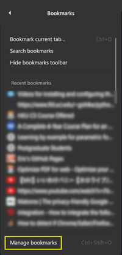

# firefox-bookmark-invalidator

## Description

`firefox-bookmark-invalidator` is a Python script designed to validate and analyze the URLs stored in your Firefox bookmarks. The script processes a JSON file exported from Firefox, checks the validity of each URL, and provides a detailed summary of valid and invalid websites. It also offers insights into the types of protocols and top-level domains used in your bookmarks.

### Features

- **URL Validation**: Tests each URL for accessibility and categorizes them as valid or invalid.
- **Error Grouping**: Groups invalid URLs by common error types for easier troubleshooting.
- **Bookmark Analysis**: Provides statistics on protocol handlers, top-level domains, and other interesting metrics.
- **System Time Check**: Ensures your system clock is synchronized with an NTP server to avoid SSL certificate validation failures due to time discrepancies.
- **Interactive Display**: Dynamically updates the terminal display with the current status of URL validation.

## Setup

```bash
pip3 install -r requirements.txt
```

## Usage

<!-- markdownlint-disable MD033 -->

| First, obtain the bookmarks `json` file from Firefox: |
|:---:|
 |  |
 |  |
 |  |

<!-- markdownlint-enable MD033 -->

Then, run the script:

```bash
python3 main.py /path/to/bookmarks.json
```

## Video in action

https://github.com/user-attachments/assets/21eb7172-3937-4c64-a0c6-882274b75490

## Thanks

Special thanks to `Claude 3.5 Sonnet` for the code assistance.
